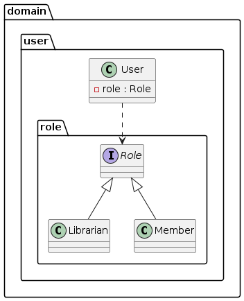
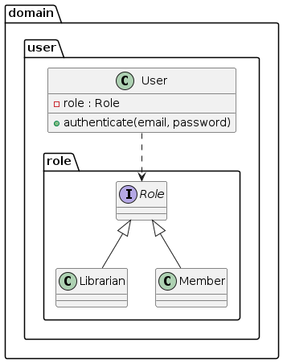
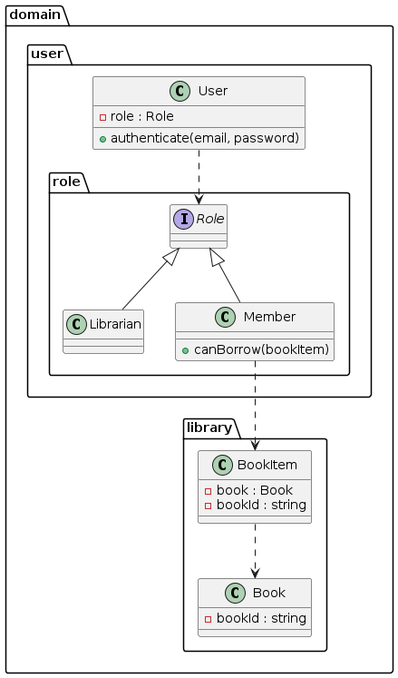
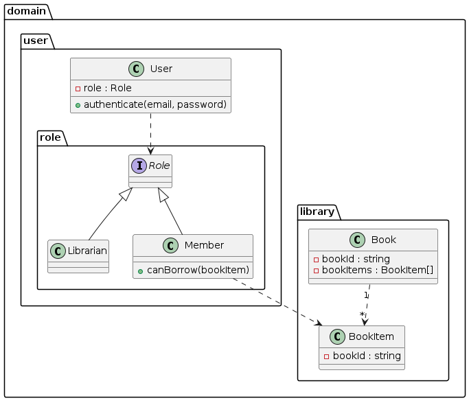

# sample-library-oop

ドメインモデルとして実装するものを想定してクラス図を作成します。別の場所で実装することになる要件は含めないものもあります。

## システム要件

### ユーザーは図書館の会員と司書の二種類

ユーザーはシステムにログインする人を表す。会員と司書は役割(`Role`)とする。



### ユーザーは電子メールアドレスとパスワードでシステムにログインする

ユーザーは、認証(`authenticate`)メソッドを持つ。



### 会員は本を借りることができる

借りるという処理の概念は大雑把すぎるので最終的にはユースケースとして実装することになるはず。会員に追加するメソッドに絞って考えるとすると、会員が有効な会員であることやブロックされていないかなど、会員の情報を元に判断する処理を会員のメソッドとする。



### 会員と司書はタイトルまたは著者名で本を検索できる

検索機能には、タイトルによる検索と著者名による検索があるということ。存在するユーザーの種類である会員と司書の両方で検索できるということは、特にドメインモデル要件として扱う必要がない。

### 司書は会員をブロックまたはブロック解除できる（本の返却が遅れている場合など）

これもブロック管理のユースケース側でログインユーザーの役割(`Role`)によって判断するように実装することになると思われるので、ドメインモデル内では表現しないことにします。

### 同じ本が何冊か所蔵されていることがある

本に関連した構造についての要件。



### 本は図書館に物理的に所蔵されている

## 図書館システムの主要なクラス

* Library：システム設計の中心部
* Book：本
* BookItem:同じ本が何冊か所蔵されている場合、それぞれの蔵書はBookItemとみなされる
* BookLending：本が貸し出されると、BookLendingオブジェクトが作成される
* Member:図書館の会員
* Librarian:図書館の司書
* User:LibrarianとMemberの基底クラス
* Catalog:所蔵本のリスト
* Author：本の著者


## Development


```bash
docker run --rm -it -v $(pwd):/usr/src smeghead7/php-class-diagram:latest bash
```
